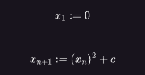
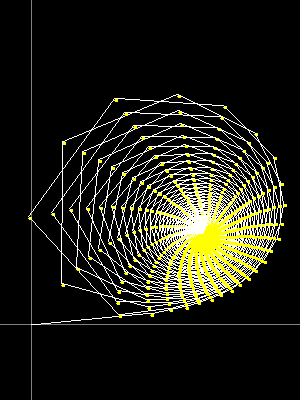
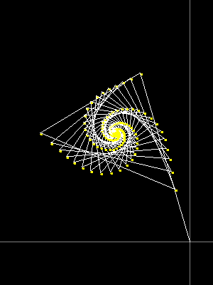
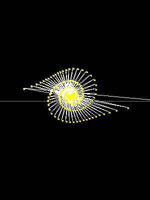
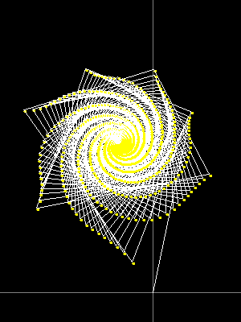
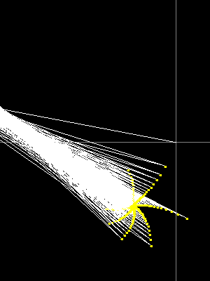
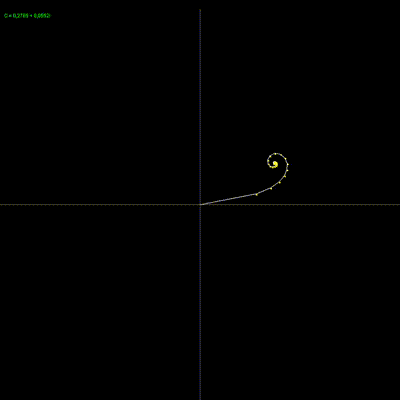

# Fraktál Projekt

## Mandelbrot

A projekt a Mandelbrot készletet jeleníti meg.
Lehetővé teszi a felhasználók számára a Mandelbrot halmaz felfedezését az egér mozgatásával a panelen,
ahol minden egérpozíció egy komplex számnak felel meg.

A matematikában a Mandelbrot-halmaz azon c komplex számokból áll 
(a „komplex számsík” azon pontjainak mértani helye, halmaza), melyekre az alábbi (komplex szám értékű)
x n rekurzív sorozat:

## Képek

## Források

Wikipedia [Mandelbrot-halmaz](https://hu.wikipedia.org/wiki/Mandelbrot-halmaz)\
Geeks For Geeks [Komplex számokkal való műveletek](https://www.geeksforgeeks.org/what-are-the-arithmetic-rules-for-complex-numbers/)\
YouTube [What's so special about the Mandelbrot Set?](https://www.youtube.com/watch?v=FFftmWSzgmk)\
YouTube [A Mandelbrot-készleten túl, bevezető a holomorf dinamikába](https://www.youtube.com/watch?v=LqbZpur38nw&t=1308s)

## Szerző
Magyar Zoltán
